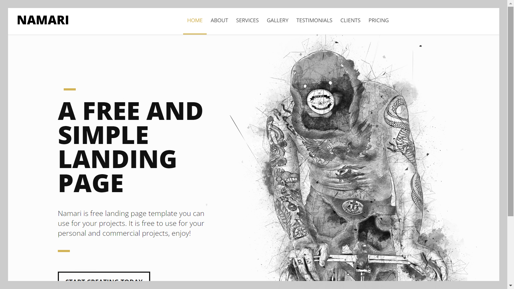

# :zap: Angular Website Example

* Converts a free Namari HTML template to an Angular app
* **Note:** to open web links in a new window use: _ctrl+click on link_


## :page_facing_up: Table of contents

* [:zap: Angular Website Example](#zap-angular-website-example)
  * [:page\_facing\_up: Table of contents](#page_facing_up-table-of-contents)
  * [:books: General info](#books-general-info)
  * [:camera: Screenshots](#camera-screenshots)
  * [:signal\_strength: Technologies](#signal_strength-technologies)
  * [:floppy\_disk: Setup](#floppy_disk-setup)
  * [:computer: Code Examples](#computer-code-examples)
  * [:cool: Features](#cool-features)
  * [:clipboard: Status \& To-Do List](#clipboard-status--to-do-list)
  * [:clap: Inspiration](#clap-inspiration)
  * [:file\_folder: License](#file_folder-license)
  * [:envelope: Contact](#envelope-contact)

## :books: General info

* Includes code from [AdMISTER STUDIOs](https://www.youtube.com/c/AdMISTERSTUDIOs/featured) - see [:clap: Inspiration](#clap-inspiration) below, but with changes to reduce lines of code and use latest Angular version. Some of the videos listed below are not applicable as I decided to just reproduce the Namari website and not include a blog, user login/logoff, auth guard, separate API etc.
* [Angular feature modules](https://angular.io/guide/feature-modules) used for organisational best practise
* Single service used to fetch data for all pages so this data can be accessed from an API. This meant I could not use custom interface classes. Each module should have its own service with interface class.

## :camera: Screenshots

.

## :signal_strength: Technologies

* [Angular v17](https://angular.io/) JS framework
* [Font Awesome v4](https://fontawesome.com/) icons
* [RxJS Library v7](https://angular.io/guide/rx-library) used to [subscribe](http://reactivex.io/documentation/operators/subscribe.html) to the API data [observable](http://reactivex.io/documentation/observable.html).
* [The HttpClient in @angular/common/http](https://angular.io/guide/http) offers a simplified client HTTP API for Angular applications that rests on the XMLHttpRequest interface exposed by browsers.

## :floppy_disk: Setup

* Run `npm i` to install dependencies.
* Run `ng serve` for a dev server.
* Navigate to `http://localhost:4200/`. The app will automatically reload if you change any of the source files.

## :computer: Code Examples

* `shared/services/config.service.ts` function to get data from API with inputs: database name and id

```typescript
getSettings(database: string, id?: number): Observable<any> {
  let url = id? `api/${database}/${id}` : `api/${database}`;
  return this.http.get<any>(url).pipe(
    catchError(this.handleError(`Error getting data from ${database}`, []))
  );
}
```

## :cool: Features

* Lazy-load modules used for most pages to speed up initial rendering of home page

## :clipboard: Status & To-Do List

* Status: Working
* To-Do: Remove unused CSS. Create separate service for each module?

## :clap: Inspiration

* [Create your first website using angular 6 -- Part 1 -- HTML Template to Angular Component](https://www.youtube.com/watch?v=LYmJOdCuXrs&list=UUcfCHgDDBw65jdnd9DTKwgg&index=19)
* [Create your first website using angular 6 -- Part 2-- Routing and Static data to configuration file](https://www.youtube.com/watch?v=JAb0vvr6foU)
* [Create your first website using angular 6 -- Part 3 -- Configuration File](https://www.youtube.com/watch?v=qBjn8TrXyPY)
* [Create your first website using angular 6 -- Part 4 -- Add BLOG Section](https://www.youtube.com/watch?v=0Nnm2rup5b8)
* [Create your first website using angular 6 -- Part 5 -- 404 Component and Pagination for blog](https://www.youtube.com/watch?v=0Nnm2rup5b8)
* [Create your first website using angular 6 -- Part 6-- Login Signup and Contact form using In Memory](https://www.youtube.com/watch?v=0Nnm2rup5b8)
* [Create your first website using angular 6 -- Part 7-- Add JQUERY and existing JS](https://www.youtube.com/watch?v=0Nnm2rup5b8)
* [Create your first website using angular 6 -- Part 8-- blog post Markdown Editor](https://www.youtube.com/watch?v=0Nnm2rup5b8)
* [Create your first website using angular 6 -- Part 9 -- Static to Dynamic Menu populated from DB](https://www.youtube.com/watch?v=0Nnm2rup5b8)
* [Create your first website using angular 6 -- Part 10 -- User Dashboard Module](https://www.youtube.com/watch?v=0Nnm2rup5b8)
* [Create your first website using angular 6 -- Part 11 -- Named Router Outlets](https://www.youtube.com/watch?v=LKCjQqzc5Ys)
* [Create your first website using angular 6 -- Part 12 -- Local Development SSL](https://www.youtube.com/watch?v=2vbWjzROtUc)
* [Create your first website using angular 6 -- Part 13 -- Components to Feature Modules](https://www.youtube.com/watch?v=WDNV4iifHwM)
* [Create your first website using angular 6 -- Part 14 -- Components to Feature Modules](https://www.youtube.com/watch?v=tj7V67-BY5U)
* [Create your first website using angular 6 -- Part 15 -- Blog Component to Blog Feature Module](https://www.youtube.com/watch?v=By4tT-bNDXY)
* [Create your first website using angular 6 -- Part 16 -- Creating email contact form API](https://www.youtube.com/watch?v=eNj9XbE9kdk&t=22s)
* [Create your first website using angular 6 -- Part 17 -- send email from Angular APP](https://www.youtube.com/watch?v=QCnoamZnTsQ&t=23s)
* [One Page Love website of html templates](https://onepagelove.com/namari)

## :file_folder: License

* N/A

## :envelope: Contact

* Repo created by [ABateman](https://github.com/AndrewJBateman), email: `gomezbateman@yahoo.com`
